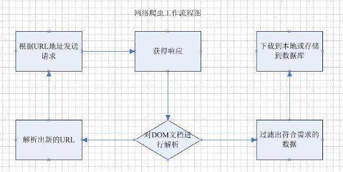
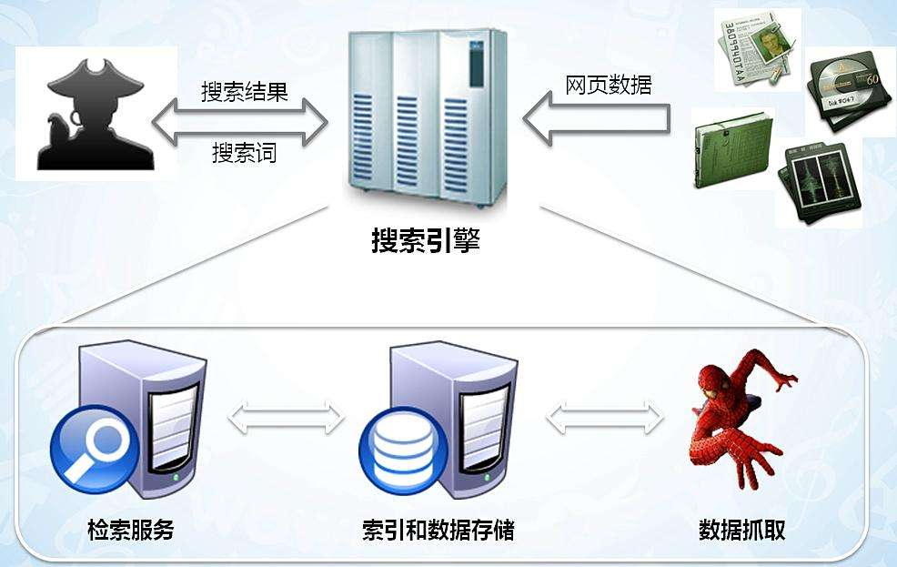
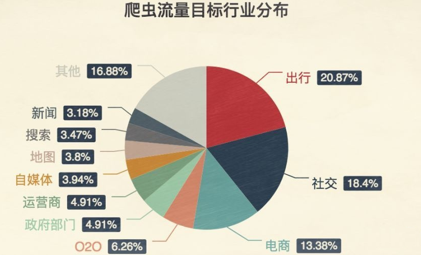
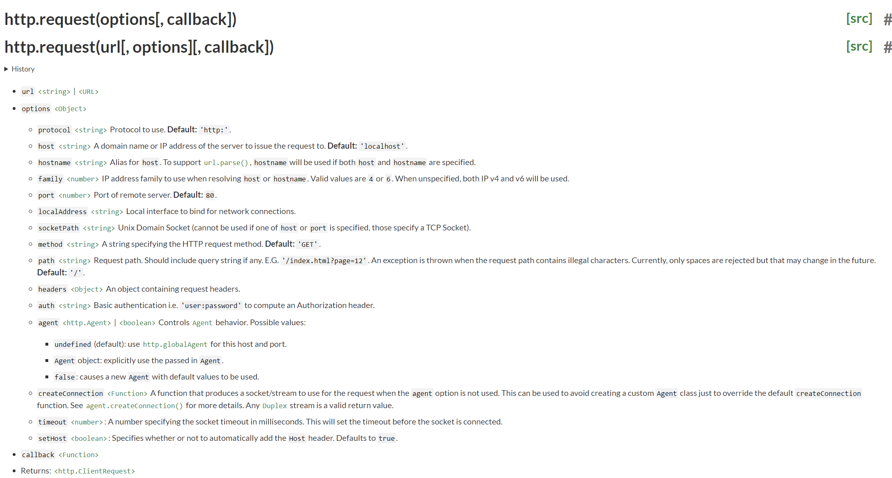
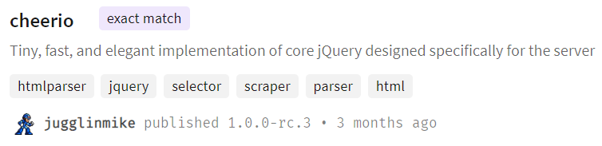
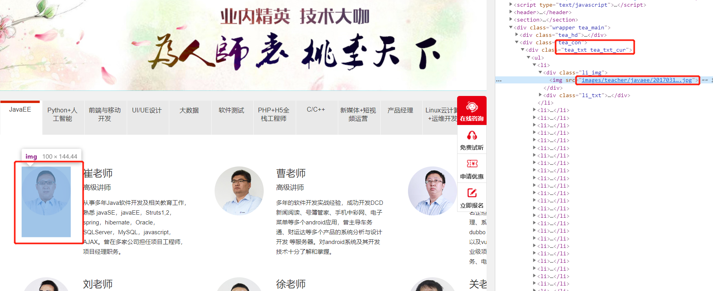

# 网络爬虫开发

# 第1章 课程介绍

## 什么是爬虫

可以把互联网比做成一张“大网”，爬虫就是在这张大网上不断爬取信息的程序

所以一句话总结：爬虫是请求网站并提取数据的自动化程序

爬虫的基本工作流程如下：

1. 向指定的URL发送http请求
2. 获取响应（HTML、XML、JSON、二进制等数据）
3. 处理数据（解析DOM、解析JSON等）
4. 将处理好的数据进行存储



## 爬虫的意义

爬虫就是一个探测程序，它的基本功能就是模拟人的行为去各个网站转悠，点点按钮，找找数据，或者把看到的信息背回来。就像一只虫子在一幢楼里不知疲倦地爬来爬去。

你可以简单地想象：**每个爬虫都是你的“分身”。就像孙悟空拔了一撮汗毛，吹出一堆猴子一样。**

你每天使用的百度和Google，其实就是利用了这种爬虫技术：每天放出无数爬虫到各个网站，把他们的信息抓回来，存到数据库中等你来检索。

抢票软件，就相当于撒出去无数个分身，每一个分身都帮助你不断刷新 12306 网站的火车余票。一旦发现有票，就马上下单，然后对你喊：大爷快来付款呀。

在现实中几乎所有行业的网站都会被爬虫所 “骚扰”，而这些骚扰都是为了方便用户



当然，有些网站是不能被过分骚扰的，其中排第一的就是出行类行业。

12306之所以会出如此变态的验证码，就是因为被爬虫折磨的无可奈何


正所谓道高一尺魔高一丈，某些爬虫工具，为了解决这种变态验证码，甚至推出了“打码平台”

原理就是爬虫还是不断工作，但只要遇到二维码，就通过打码平台下发任务，打码平台另一边就雇佣一大堆网络闲人，只要看到有验证码来了，就人工选一下验证码，完美的让程序与人工结合！


## 课程内容及目标

1. 爬虫简介
2. 制作一个自动下载图片的小爬虫
3. 使用Selenium爬取动态网站

## 前置知识

1. js基础
2. node基础

# 第二章 爬虫基础

学习目标:

- 以`http://web.itheima.com/teacher.html`网站目标为例，最终目的是下载网站中所有老师的照片：


下载所有老师的照片，需要通过如下步骤实现：

1. 发送http请求，获取整个网页内容
2. 通过cheerio对网页内容进行分析
3. 提取img标签的src属性
4. 使用download库进行批量图片下载

## 发送一个HTTP请求

学习目标：

- 发送HTTP请求并获取相应

在学习爬虫之前，需要对HTTP请求充分了解，因为爬虫的原理就是发送请求到指定URL，获取响应后并处理

### node官方api

node的核心模块 http模块即可发送请求，摘自node官网api：



由此可见只需要使用`http.request()`方法即可发送http请求

### 发送http请求案例


代码如下：

```js
// 引入http模块
const http = require('http')
// 创建请求对象
let req = http.request('http://web.itheima.com/teacher.html', res => {
  // 准备chunks
  let chunks = []
  res.on('data', chunk => {
    // 监听到数据就存储
    chunks.push(chunk)
  })
  res.on('end', () => {
    // 结束数据监听时讲所有内容拼接
    console.log(Buffer.concat(chunks).toString('utf-8'))
  })
})
// 发送请求
req.end()
```

得到的结果就是整个HTML网页内容

## 将获取的HTML字符串使用cheerio解析

学习目标：

- 使用cheerio加载HTML
- 回顾jQueryAPI
- 加载所有的img标签的src属性

### cheerio库简介



> 这是一个核心api按照jquery来设计，专门在服务器上使用，一个微小、快速和优雅的实现

简而言之，就是可以再服务器上用这个库来解析HTML代码，并且可以直接使用和jQuery一样的api

官方demo如下：

```js
const cheerio = require('cheerio')
const $ = cheerio.load('<h2 class="title">Hello world</h2>')
 
$('h2.title').text('Hello there!')
$('h2').addClass('welcome')
 
$.html()
//=> <html><head></head><body><h2 class="title welcome">Hello there!</h2></body></html>
```

同样也可以通过jQuery的api来获取DOM元素中的属性和内容

### 使用cheerio解析HTML

分析网页中所有img标签所在结构

